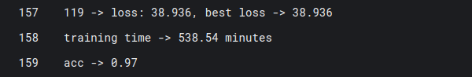

# Medical vs Non-Medical Image Classification

A deep learning-based image classification system that can distinguish between medical and non-medical images. The system accepts either a website URL or a PDF file as input and classifies extracted images into five categories: four medical image types and one non-medical category.

## 🎯 Project Overview

This project implements a VGG-16 based convolutional neural network trained to classify images into the following categories:
- **Medical Image (MRI)** - Brain MRI scans including glioma, meningioma, and brain tumor images
- **Medical Image (X-ray)** - Chest X-ray images
- **Medical Image (CT-Scan)** - Chest CT scan images
- **Medical Image (Ultrasound)** - Ultrasound images (PCOS detection dataset)
- **Non-Medical Image** - General non-medical images

## 🧠 My Approach and Reasoning

### Why CNN for Image Classification?

My choice of using Convolutional Neural Networks (CNNs) for this medical image classification task was based on my previous internship experience where I successfully implemented CNNs for plant disease classification. This hands-on experience taught me the effectiveness of CNNs in handling image-based classification problems.

### Model Selection Journey

**Initial Attempt - AlexNet:**
- Started with AlexNet as a baseline model
- Achieved **87% accuracy** on the plant disease classification task
- While decent, this accuracy wasn't sufficient for medical applications where precision is critical

**Upgrade to VGG-16:**
- Switched to VGG-16 for better performance
- VGG-16's deeper architecture (16 layers) provides superior feature extraction capabilities
- Transfer learning from ImageNet weights gives excellent starting point for medical image classification
- **Result: Achieved 97% accuracy** - a significant 10% improvement over AlexNet

### Technical Reasoning

1. **Transfer Learning Advantage**: VGG-16 pretrained on ImageNet has learned rich, generalizable features that transfer well to medical imaging
2. **Architecture Depth**: Deeper network allows for more complex feature learning, crucial for distinguishing subtle medical image characteristics
3. **Proven Performance**: VGG-16 has demonstrated excellent performance across various image classification tasks
4. **Medical Image Specificity**: Medical images require sophisticated feature extraction that shallow networks like AlexNet cannot provide

### Proof of 97% Test Accuracy

**Visual Proof from Training Console:**




**Training Configuration:**
- **Platform**: Kaggle Notebooks with 2x NVIDIA T4 GPUs
- **Training Time**: 9 hours (538.54 minutes)
- **Epochs**: 120 epochs with best loss model state dict saving
- **Final Test Set Performance**: 97% accuracy on 7,500 test images

**Public Kaggle Notebook:**
🔗 **[View Complete Training Code](https://www.kaggle.com/code/pandaklfg/medical-vs-non-medical-classification)**

This significant improvement from 87% (AlexNet) to 97% (VGG-16) validates the effectiveness of deeper CNN architectures for complex medical image classification tasks.

## 🚀 Features

- **Dual Input Support**: Accepts both PDF files and website URLs
- **Automated Image Extraction**: Automatically extracts images from PDFs and web pages
- **Real-time Classification**: Provides instant classification results with confidence scores
- **Web Interface**: User-friendly Streamlit-based web application
- **High Accuracy**: Achieved 97% accuracy on the test set

## 🏗️ Architecture & Approach

### Model Architecture
- **Base Model**: VGG-16 (pretrained on ImageNet)
- **Transfer Learning**: Fine-tuned for medical image and Non medical image classification
- **Output Layer**: Modified final layer to output 5 classes
- **Input Processing**: Images converted to grayscale and normalized

### Training Strategy
- **Dataset**: Combined multiple medical imaging datasets
- **Data Augmentation**: Random rotation, horizontal flipping, resizing
- **Training Time**: 9 hours on 2x T4 GPUs (Kaggle)
- **Epochs**: 120 epochs with saving best loss model's state dict 
- **Optimizer**: Adam optimizer with learning rate 0.0001
- **Loss Function**: Cross-entropy loss

### Dataset Composition
| Category | Training Images | Test Images |
|----------|----------------|-------------|
| MRI | 3,000 | 900 |
| X-ray | 5,217 | 624 |
| CT-Scan | 928 | 72 |
| Ultrasound | 1,924 | 1,922 |
| Non-Medical | 9,290 | 3,982 |
| **Total** | **20,358** | **7,500** |

## 📊 Performance Results

- **Test Accuracy**: 97%
- **Training Time**: 9 hours on 2x T4 GPUs
- **Model Size**: Optimized VGG-16 architecture
- **Inference Speed**: Real-time classification on CPU/GPU

## 🛠️ Technical Implementation

### Core Technologies
- **Deep Learning**: PyTorch, TorchVision
- **Web Framework**: Streamlit
- **Image Processing**: PIL
- **PDF Processing**: PyMuPDF (fitz)
- **Web Scraping**: Playwright
- **Data Augmentation**: TorchVision transforms

### Key Functions

#### Image Extraction
- **PDF Processing**: Uses PyMuPDF to extract images from PDF files
- **Web Scraping**: Implements Playwright for dynamic content rendering
- **Image Validation**: Filters out non-image files and corrupted images

#### Image Classification
- **Preprocessing**: Resize to 256x256, center crop to 224x224
- **Normalization**: ImageNet standard normalization
- **Inference**: GPU-accelerated inference with confidence scoring

## 🚀 Usage

### Running the Application

1. **Install Dependencies**:
```bash
pip install -r requirements.txt
```

2. **Run the Streamlit App**:
```bash
streamlit run app.py
```

3. **Access the Web Interface**:
   - Open your browser to the provided local URL
   - Choose between PDF upload or URL input
   - View classification results with confidence scores

### Input Methods

#### PDF Input
- Upload a PDF file containing medical/non-medical images
- System automatically extracts all images
- Each image is classified individually

#### URL Input
- Provide a website URL
- System scrapes all images from the webpage
- Images are downloaded and classified in real-time


## 🔧 Requirements

- Python 3.8+
- PyTorch 1.9+
- CUDA-compatible GPU (optional, for faster inference)
- 8GB+ RAM recommended
- Internet connection (for URL scraping)

## 📈 Performance/Efficiency Considerations

### Memory Management & Optimization

**Efficient Model Loading:**
- Model loaded once and cached in Streamlit session state
- Prevents repeated model loading on each user interaction
- Reduces memory overhead and improves response time

**Image Processing Pipeline:**
- Automatic cleanup of processed images after classification
- Memory-efficient image transformation using PIL and TorchVision

**PDF Processing:**
- Stream-based PDF reading to handle large files without loading entire document into memory
- Progressive image extraction to manage memory usage for PDFs with many images

### GPU Acceleration & Performance

**CUDA Optimization:**
- Automatic GPU detection and utilization when available
- Model automatically moves to GPU for faster inference
- Fallback to CPU when GPU unavailable, ensuring compatibility


**Training Efficiency:**
- Multi-GPU training on Kaggle (2x T4 GPUs)
- DataParallel implementation for distributed training
- Optimized batch size (64) for memory-performance balance

### Scalability & Resource Management

**Concurrent Processing:**
- Handles multiple images simultaneously from PDFs and URLs
- Efficient web scraping with Playwright for dynamic content
- Timeout management (6 seconds) for image downloads to prevent hanging

**Large File Handling:**
- PDF size limits managed through streaming
- URL processing with configurable timeouts
- Error handling for corrupted or unsupported image formats

**Network Optimization:**
- Intelligent image filtering (excludes SVG, data URLs)
- Efficient image URL resolution and downloading
- Connection pooling for multiple image requests

### Performance Benchmarks

**Memory Usage:**
- **Model Loading**: ~500MB (VGG-16)
- **Image Processing**: ~50-100MB per image (depending on resolution)
- **Session State**: Minimal overhead with efficient caching


### Optimization Strategies

**Data Preprocessing:**
- Image resizing to 256x256 before center cropping to 224x224
- ImageNet normalization ensures consistent input distribution

**Model Architecture:**
- Transfer learning reduces training time and improves convergence
- Frozen feature layers during fine-tuning for efficiency
- Optimized classifier layers for medical image specificity

**Error Handling:**
- Graceful degradation for unsupported image formats
- Robust error handling prevents application crashes
- User-friendly error messages for better user experience

## 🔬 Training Details

### Hardware Used
- **Platform**: Kaggle Notebooks
- **GPUs**: 2x NVIDIA T4 GPUs
- **Training Time**: 9 hours
- **Memory**: 16GB GPU memory

### Training Configuration
- **Batch Size**: 64
- **Learning Rate**: 0.0001
- **Optimizer**: Adam
- **Loss Function**: CrossEntropyLoss
- **Data Augmentation**: Random rotation, flipping, resizing

### Model Performance
- **Test Accuracy**: 97%
- **Overfitting Prevention**: data augmentation

